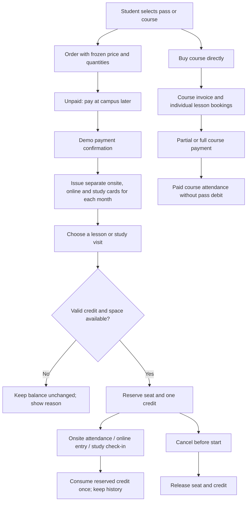

# Demo workflow review - 2026-09-19

## Scope and deployment

Repository: minoscao/education-management. Target: education.minoscao.workers.dev.
The user confirmed shared demo data and role switching, without accounts for now.
Cloudflare email login remains future work. No GPTSite deployment is maintained.

## Critical findings corrected

| Finding | Correction |
| --- | --- |
| Payment and card issuance could disagree or issue twice | Atomic payment, order and independent monthly card issuance; stable retry keys |
| Delayed payment used changed product settings | Price, quotas and validity frozen on the order |
| Future cards could be used immediately | Service-date validity and earliest-expiry credit allocation |
| Reserved lessons did not protect available credits | Persistent holds; available balance excludes reservations |
| Single-lesson booking looked like whole-course enrolment | Separate single-lesson enrolment state and actual booking-based student views |
| Repeated attendance or online entry could debit repeatedly | One credit event per booking; audited transitions and transactional debit |
| No classroom URL could still consume an online credit | Validate secure URL and joining window before any debit |
| Cancellation left seats or credits held | Booking, attendance and hold changes committed together |
| Individual lessons upgraded to a course could double-charge | Existing holds released when direct-course payment replaces them |
| Study visits had no complete booking/check-in lifecycle | Persisted room booking, capacity/conflict checks, reservation and check-in debit |
| Partial course receipts and discounts could diverge | Transactional invoice totals, overpayment guard, no double enrolment discount |
| Legacy admin routes used disconnected tables | Redirect old screens to the shared portal; retired API returns 410; historical tables retained |
| Fresh database seed could fail foreign keys | Seed teaching languages before teacher-language references |
| Generic builds could migrate production unexpectedly | Build/test first; automatic migrations limited to the production build branch |
| Two automatic deployment pipelines raced on each push | Workers Builds remains automatic; GitHub Actions is a manual fallback only |
| Save failures could close dialogs as if successful | Shared boolean save result; failed forms remain open; full visible error feedback |
| Course pass choice promised monthly payments but charged upfront | Actual inclusive calendar-month count, explicit total price, no false full-course reservation for one-month purchase |

## Current operating flow

## Verification evidence

- 22 automated tests pass, including duplicate requests, interrupted payment rollback,
  calendar months, expiry, partial receipts, online entry, attendance correction,
  study conflicts, cancellation/rebooking and legacy card preservation.
- Production build and TypeScript check pass.
- Changed core frontend/backend files: zero ESLint errors; 35 older frontend warnings
  remain, mainly unused declarations and dependency guidance. Not a claim of a
  warning-free repository.
- Production D1 backup replayed in local SQLite with migrations 0015-0018 and repeated
  initialization: 1,488 student records preserved, integrity and foreign keys pass.
- Real local browser: buy pass and confirm payment, independent cards and balances,
  single-lesson booking/cancellation, study reservation/cancellation, premature
  check-in rejection, dialog Escape behavior, legacy URL redirects, desktop/mobile.
- Browser test purchases were local only. No test payment was made in live D1.
- Remote D1 rejected unparenthesized CASE expressions in trigger migrations despite
  local SQLite accepting them. Compatible expressions were verified by successfully
  applying all four migrations remotely; a regression check and SQL LF policy were added.

## Remaining boundaries

### Follow-up: detail editing and historical demo links

- Course, class intake, student, teacher, lesson and classroom details now share
  an explicit pencil edit action. Narrow-screen styles no longer hide that action.
- Room and class metadata use the same data-driven editing dialog. Saves refresh
  the portal data; failed saves leave the form open. Course editing also traps
  keyboard focus and supports Escape.
- Classroom editing persists name, campus, location, capacity, type and resources.
  Capacity changes are checked against scheduled classes and existing reservations;
  changing a class price leaves existing invoices unchanged.
- The known `plan-enrollment-*` demo seed had enrolments without invoices,
  lesson bookings or attendance records. A retry-safe transaction repairs those
  links only, using stored fees, unpaid invoices and pending attendance. It never
  invents payments or checked-in students and excludes other/partial purchases.
- Local snapshot replay preserved all 1,488 students and produced 8,928 bookings
  with no foreign-key errors. Local API checks verified course save/read-back and
  classroom saving. Build, typecheck and 25 automated tests pass.
- Browser navigation/DOM inspection worked, but click and screenshot commands
  timed out during this follow-up. New edit-dialog visual testing is not claimed.

### Follow-up: student booking checkout

- The student flow is course/lesson selection, attendance mode, then existing
  pass balance or a new pass. The old course-vs-pass comparison and repeated
  class-selection stage are removed from new student bookings.
- Checkout retains run, individual lesson (when selected), and online/onsite mode.
  The saved order snapshot carries the same selection through deferred payment.
- A shared date-aware credit planner checks per-lesson validity and unreserved
  balances. A new pass offer must cover the selection together with existing
  credits; incompatible offers cannot be confirmed.
- Payment confirmation issues cards and completes the saved booking. Booking
  failures after issuance are reported separately, retain the checkout, and can
  be retried without a second payment. Pending pass orders appear on the original
  course and can be paid there without choosing the course again.
- Seat availability and learner timetable clashes are checked before order creation
  and again before payment, so a class that filled while an order was unpaid does
  not issue cards or collect a payment. Final booking guards still handle races.
- 31 tests pass. Local HTTP end-to-end checks verified deferred online lesson
  purchase, exact lesson preservation, three issued cards, whole-course online
  purchase and repeated payment/purchase without duplicate orders or payments.
- These purchases were local demo tests, not production transactions. Live browser
  click/screenshot verification remains unavailable due to browser-control timeouts.

- This is a shared, unauthenticated demo. Do not use real student personal data,
  payment details or private teaching links until authentication, authorization,
  tenant isolation and abuse controls are implemented.
- Payment confirmation is a demo/manual receipt, not a payment-gateway transaction.
- Confirmed monthly product policy: RM160, 4 onsite / 6 online / 2 study,
  30 days from a student-selected start date. Each visit is an independent
  one-use ticket. Existing issued cards and frozen order snapshots are preserved.
- Additional cards remain independently purchasable; coverage determines whether
  the saved course can also be booked, not whether the student may buy credits.
  Onsite 4 costs RM100, online 6 costs RM90 and study 10 costs RM50.
- 36 tests pass, including rolling expiry, separate ticket issuance, top-ups for
  a different delivery mode, insufficient whole-course coverage, full-class top-up,
  legacy orders, retries, and phone normalization. Local HTTP checkout verified
  RM160 / 12 tickets / 2026-09-21 through 2026-10-20; payment retry stayed at 12.
- Student-bearing shared tables resolve guardian contacts from the student
  directory. WhatsApp opens a user-confirmed chat; communication drafts are stored
  with their channel and never marked sent by merely saving or opening a link.
- WhatsApp Business is not connected. Automatic sending, bulk sending and delivery
  receipts must wait for official onboarding and authenticated administrator access.
  No real outbound messages were sent. Never put the business access token in the
  browser bundle, public repository, or this shared demo's settings response.
- Refunds, no-show penalties, leave cutoffs and instalment financing require agreed
  policy. The review does not claim these unfinished commercial workflows are closed.
- Moving a reserved lesson outside card validity, or moving a consumed lesson, is
  blocked instead of silently changing financial records. A guided transfer/refund
  workflow remains future work.
- Existing historical demo clashes are preserved rather than deleting records to
  force the database to look clean. New reservations enforce capacity and overlap.
- The large legacy portal component remains a maintenance risk. Common credit,
  conflict, dialog, preference and clock behavior is now shared, but this is not
  a wholesale rewrite of all legacy UI.

## Operational reference

Cloudflare's documented build variables and Workers Builds status endpoints are used
for production-only migration gating and deployment verification:
[Build configuration](https://developers.cloudflare.com/workers/ci-cd/builds/configuration/),
[Builds API](https://developers.cloudflare.com/workers/ci-cd/builds/api-reference/).
Remote trigger compatibility:
[Cloudflare SDK issue 4727](https://github.com/cloudflare/workers-sdk/issues/4727).
