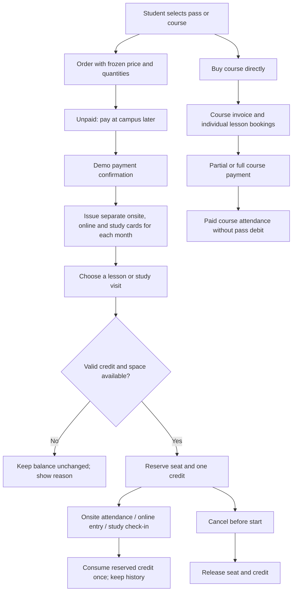

# Demo workflow review - 2026-09-19

## Scope and deployment

Repository: minoscao/education-management. Target: education.minoscao.workers.dev.
The user confirmed shared demo data and role switching, without accounts for now.
Cloudflare email login remains future work. No GPTSite deployment is maintained.

## Critical findings corrected

| Finding | Correction |
| --- | --- |
| Payment and card issuance could disagree or issue twice | Atomic payment, order and independent monthly card issuance; stable retry keys |
| Delayed payment used changed product settings | Price, quotas and validity frozen on the order |
| Future cards could be used immediately | Service-date validity and earliest-expiry credit allocation |
| Reserved lessons did not protect available credits | Persistent holds; available balance excludes reservations |
| Single-lesson booking looked like whole-course enrolment | Separate single-lesson enrolment state and actual booking-based student views |
| Repeated attendance or online entry could debit repeatedly | One credit event per booking; audited transitions and transactional debit |
| No classroom URL could still consume an online credit | Validate secure URL and joining window before any debit |
| Cancellation left seats or credits held | Booking, attendance and hold changes committed together |
| Individual lessons upgraded to a course could double-charge | Existing holds released when direct-course payment replaces them |
| Study visits had no complete booking/check-in lifecycle | Persisted room booking, capacity/conflict checks, reservation and check-in debit |
| Partial course receipts and discounts could diverge | Transactional invoice totals, overpayment guard, no double enrolment discount |
| Legacy admin routes used disconnected tables | Redirect old screens to the shared portal; retired API returns 410; historical tables retained |
| Fresh database seed could fail foreign keys | Seed teaching languages before teacher-language references |
| Generic builds could migrate production unexpectedly | Build/test first; automatic migrations limited to the production build branch |
| Two automatic deployment pipelines raced on each push | Workers Builds remains automatic; GitHub Actions is a manual fallback only |
| Save failures could close dialogs as if successful | Shared boolean save result; failed forms remain open; full visible error feedback |
| Course pass choice promised monthly payments but charged upfront | Actual inclusive calendar-month count, explicit total price, no false full-course reservation for one-month purchase |

## Current operating flow

## Verification evidence

- 21 automated tests pass, including duplicate requests, interrupted payment rollback,
  calendar months, expiry, partial receipts, online entry, attendance correction,
  study conflicts, cancellation/rebooking and legacy card preservation.
- Production build and TypeScript check pass.
- Changed core frontend/backend files: zero ESLint errors; 35 older frontend warnings
  remain, mainly unused declarations and dependency guidance. Not a claim of a
  warning-free repository.
- Production D1 backup replayed in local SQLite with migrations 0015-0018 and repeated
  initialization: 1,488 student records preserved, integrity and foreign keys pass.
- Real local browser: buy pass and confirm payment, independent cards and balances,
  single-lesson booking/cancellation, study reservation/cancellation, premature
  check-in rejection, dialog Escape behavior, legacy URL redirects, desktop/mobile.
- Browser test purchases were local only. No test payment was made in live D1.

## Remaining boundaries

- This is a shared, unauthenticated demo. Do not use real student personal data,
  payment details or private teaching links until authentication, authorization,
  tenant isolation and abuse controls are implemented.
- Payment confirmation is a demo/manual receipt, not a payment-gateway transaction.
- Current product configuration remains RM160 with 12 onsite / 24 online / 6 study
  visits per month. The earlier 4 / 6 / 2 request needs final confirmation; no
  silent quota migration has been applied.
- Refunds, no-show penalties, leave cutoffs and instalment financing require agreed
  policy. The review does not claim these unfinished commercial workflows are closed.
- Moving a reserved lesson outside card validity, or moving a consumed lesson, is
  blocked instead of silently changing financial records. A guided transfer/refund
  workflow remains future work.
- Existing historical demo clashes are preserved rather than deleting records to
  force the database to look clean. New reservations enforce capacity and overlap.
- The large legacy portal component remains a maintenance risk. Common credit,
  conflict, dialog, preference and clock behavior is now shared, but this is not
  a wholesale rewrite of all legacy UI.

## Operational reference

Cloudflare's documented build variables and Workers Builds status endpoints are used
for production-only migration gating and deployment verification:
[Build configuration](https://developers.cloudflare.com/workers/ci-cd/builds/configuration/),
[Builds API](https://developers.cloudflare.com/workers/ci-cd/builds/api-reference/).
